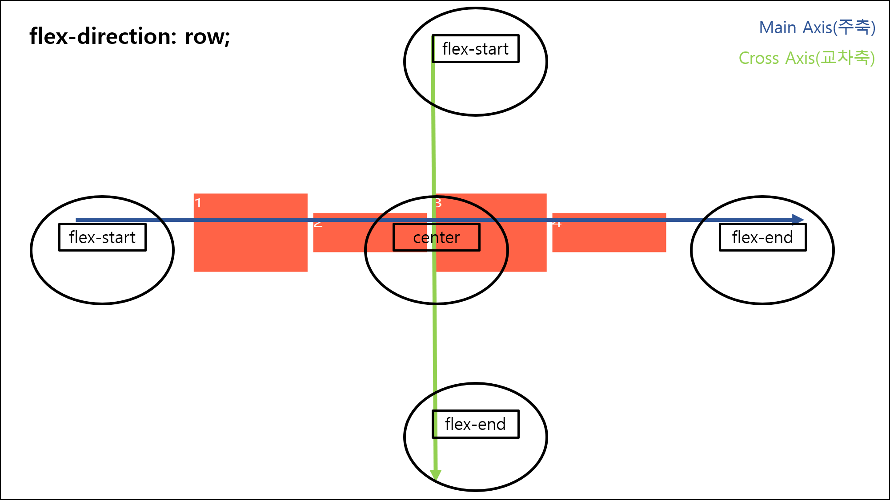
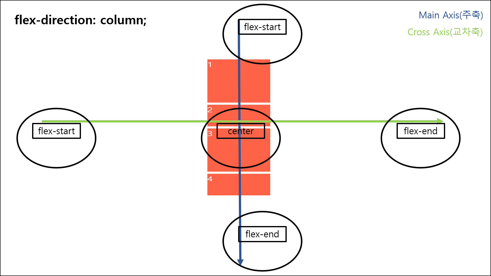

> [노마드코더 - CSS Layout 마스터클래스](https://nomadcoders.co/css-layout-masterclass) 강의를 정리한 내용입니다.

# Flex Box

## before FlexBox

**FlexBox** 등장 이전에는 요소가 가지는 기본 특성을 이용해 화면을 구성했다.

`block` 속성을 가진 요소는 `width`와 `height`를 가지며 화면의 한 줄을 전부 차지하고 다른 요소가 옆으로 오는 것을 막는다.

반면에, `inline`은 `width`와 `height` 속성을 가지지 않으면서 해당 줄(line) 안(in)에 속한다.

`block` 요소를 가지면서 `inline`으로 정렬하고 싶다면 `display: inline-block`을 선언한다.

```css
.box {
  width: 200px;
  height: 200px;
  background-color: tomato;
  display: inline-block;
}

.box:first-child {
  margin-left: 300px; /* 350px, 310px, 315px ...*/
}

.box:last-child {
  margin-right: 300px; /* 350px, 310px, 315px ...*/
}
```

화면 정렬에 대한 요구사항이 들어왔다면 위처럼 하나씩 계산해 정렬한다.

`float`을 통해 요소의 정렬을 조금 더 쉽게 할 수 있다. 그러나 세세한 설정은 수동으로 조작해야 한다.

```css
.box:first-child {
  float: left;
}

.box:last-child {
  float: right;
}

.box:nth-child(2) {
  margin: 0 50%; /* 25%, 13%, 10% ...*/
}
```

하나하나 조정해야 하는 방식은 **명령형**이며, 이러한 방법은 번거롭고 어렵다. 다양한 화면 크기가 등장하면서 이 어려움은 더욱 심화되었다.

요구사항이 다양해지면서 **그렇게 되어야 한다**라고 브라우저에게 알려주면 알아서 계산해주는 방식인 **선언형**이 등장했다.

예를 들어, **text-align** 속성은 브라우저에게 **항상 문자열은 이렇게 정렬되어야 한다**를 선언하고, 이후 작성된 문자열은 모두 해당 속성에 맞게 **알아서** 정렬된다.

**선언형**으로 화면 구성을 그려주는 것이 **FlexBox**이다.

## FlexBox

**FlexBox**는 `inline-block`이나 `float`과 다르게 자식 요소에 관심이 없다. 부모 요소에 작성하면 그대로 자식 요소를 정렬한다. 단, 바로 아래 있는 **직속** 자식이어야 만한다.

```css
.father {
  display: flex;
  justify-content: space-between;
}

.box {
  width: 200px;
  height: 200px;
  background-color: tomato;
}
```

예시로, `justify-content: space-between`를 선언하면 `margin`을 계산할 필요없이 첫 번째와 마지막 `box`는 양 끝에, 두 번째 `box`는 가운데로 정렬한다.

### FlexBox Properties

`FlexBox`의 속성은 전부 `부모` 요소에서 작성한다.

#### gap

자식 요소마다 `margin`을 부여하고 싶다면 `gap` 속성을 사용한다.

```css
.father {
  display: flex;
  gap: 10px;
}
```

`gap`은 `row-gap`과 `column-gap`을 합친 속성이다. 한 줄로 행열 `margin`을 설정하고 싶다면 `gap: row-gap column-gap` 순서로 작성한다.

#### flex-direction

자식 요소 정렬 방향을 정하는 속성은 `flex-direction`이며, 기본값은 `row`이다. 세로로 정렬할 시에는 `column`으로 작성한다. 또한, 정렬되는 자식 요소의 순서를 뒤집을 때는 `-reverse` 접미사를 더한다.

```css
.father {
  display: flex;
  gap: 10px;
  flex-direction: column; /* default: row*/
  /* row-reverse, column-reverse */
}
```

#### justify-content(주축) and align-items(교차축)

`flex-direction`이 정하는 방향은 매우 중요하다. `FlexBox`를 정의하는 두 개의 축이 있기 때문이다. **`Main Axis(주축)`**와 **`Cross Axis(교차축)`**이다.

**`Main Axis(주축)`**는 방향이 `row`일 때는 가로선(왼쪽➡오른쪽)이 되고, `column`일 때는 세로선(위쪽➡아래쪽)이 된다. **`Cross Axis(교차축)`**은 그와 반대, 즉 `row`일 때는 세로선이, `column`일 때는 가로선이 된다. `-reverse`는 반대 방향으로 동작한다.

**`Main Axis(주축)`**의 요소 이동은 `justify-content` 속성을 사용한다.

**`Cross Axis(교차축)`**의 요소 이동은 `align-items` 속성을 사용한다.

##### `flex-direction`이 `row`인 경우



##### `flex-direction`이 `column`인 경우



#### flex-wrap

flex 컨테이너가 한 줄인지, 여러 줄인지 정한다.

기본값은 `nowrap`으로, 자식 요소를 전부 한 줄에 압축해 넣는다. 자식 요소의 기본 크기는 무시된다.

`wrap`인 경우, 컨테이너를 넘치는 자식 요소의 경우 다음 줄로 내린다.

`-reverse` suffix를 가지고 있다.

#### flex-flow

`flex-direction`과 `flex-wrap`을 합쳐 놓은 단축 속성이다. `flex-flow: row wrap` 형태로 사용한다.

#### align-content

컨테이너가 여러 줄(`flex-wrap: wrap`)일 때 요소들을 줄에 맞춰 정렬한다.

```css
.father {
  display: flex;
  height: 100vh;
  width: 100%;
  gap: 10px;
  justify-content: center;
  align-items: flex-start;
  flex-flow: row wrap;
}
```

가령, 이렇게 작성하면 첫 번째 줄과 두 번째 줄 사이에 빈 공간이 생긴다. 이 간격은 `align-content`를 사용해 줄일 수 있다.

```css
.father {
  /* ... */
  align-content: center;
}
```

교차축의 가운데를 기준으로 모든 라인이 정렬된다.

#### order

자식 요소에 부여하는 속성으로, flex 컨테이너 내부에서 자식 요소의 순서를 결정한다.

순서는 상대적으로 정해지며, 기본값은 `0`이다.

```css
.box:nth-child(3) {
  order: 1;
  background-color: blueviolet;
}

.box:nth-child(6) {
  order: 2;
  background-color: aqua;
}
```

이렇게 작성할 경우 `box 3`은 끝에서 **2번째**로, `box 6`은 **맨끝**으로 이동한다. 나머지 `box`의 `order`가 `0`이기 때문이다.

#### align-self

자식 요소에 부여하는 속성으로, 요소에 개별적으로 `align-items` 속성을 적용한다.

```css
.father {
  display: flex;
  height: 100vh;
  width: 100%;
  gap: 10px;
  justify-content: center;
  align-items: center;
  flex-flow: row wrap;
}

.box {
  width: 200px;
  height: 200px;
  background-color: tomato;
}

.box:first-child {
  background-color: blueviolet;
  align-self: flex-start;
}

.box:last-child {
  background-color: aqua;
  align-self: flex-end;
}
```

#### flex-grow

자식 요소에서 설정하며, 값을 직접 설정하지 않고 flex 컨테이너의 크기만큼 늘리는 속성이다. 기본값은 **0**이고 단위는 비율로 사용한다. `flex-grow: 1`이라면 flex 컨테이너의 공간 최대 크기만큼 늘어난다.

```css
.box:first-child {
  background-color: blueviolet;
  flex-grow: 1;
}

.box:last-child {
  background-color: aqua;
  flex-grow: 1;
}
```

두 개의 박스가 1:1 비율로 컨테이너의 공간만큼 늘어난다.

#### flex-shrink

자식 요소에서 설정하며, 값을 직접 설정하지 않고 flex 컨테이너의 비율에 맞춰 줄이는 속성이다. 기본값은 **1**이다.

```css
.box:first-child {
  background-color: blueviolet;
  flex-shrink: 3;
}

.box:nth-child(2) {
  background-color: teal;
  flex-shrink: 0;
}

.box:last-child {
  background-color: aqua;
  flex-shrink: 1;
}
```

`box 2`는 화면 크기가 줄어도 크기가 그대로인 반면, `box 1`과 `box 3`은 크기가 줄어든다.

#### flex-basis

자식 요소에서 설정하며, `flex-grow`와 `flex-shrink`의 초기값을 설정하는 속성이다. `flex-basis: 500px`로 설정하면 크기가 `500`을 넘어가는 시점에서 `grow`되거나 `shrink`된다.

```css
.box:first-child {
  background-color: blueviolet;
  flex-grow: 1;
  flex-shrink: 0;
  flex-basis: 500px;
}
```

위 코드에서 `box 1`은 화면이 아무리 작아져도 `500px` 아래로는 줄어들지 않는다.

#### flex

위의 세 속성, `flex-grow`, `flex-shrink`, `flex-basis`를 하나로 합친 단축 속성이다. `flex: grow shrink basis` 순서로 적는다.

```css
.box:first-child {
  background-color: blueviolet;
  flex: 1 0 500px;
}
```

#### Flexbox Froggy Game

FlexBox를 게임으로 연습할 수 있는 사이트이다.

https://flexboxfroggy.com/#ko
