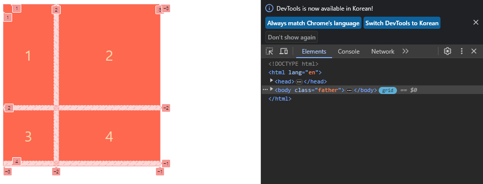
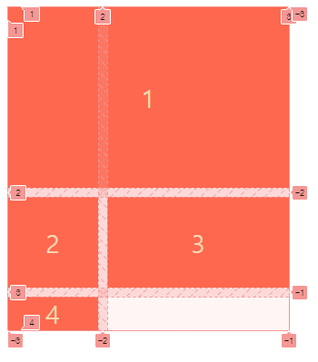
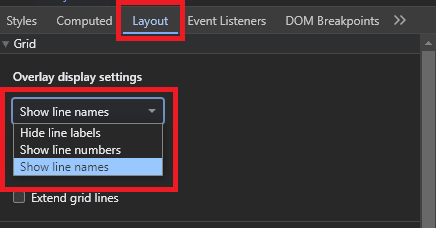
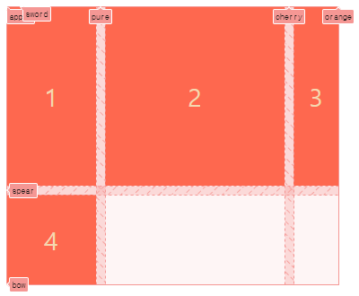
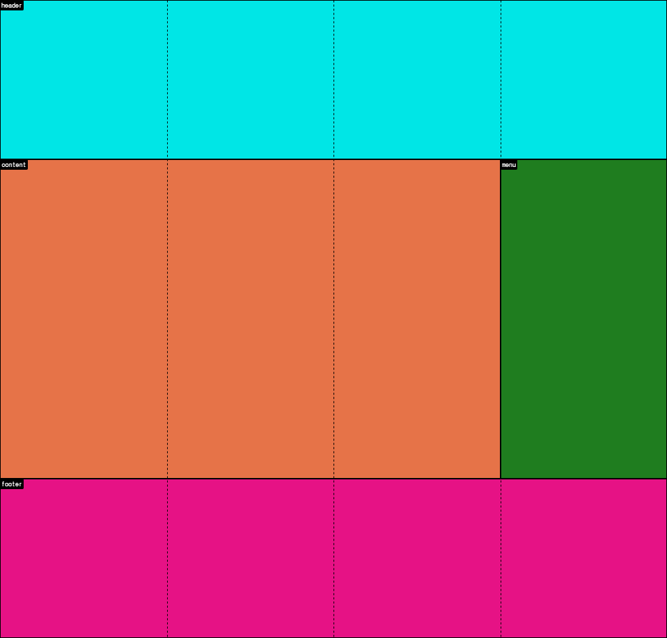

> [노마드코더 - CSS Layout 마스터클래스](https://nomadcoders.co/css-layout-masterclass) 강의를 정리한 내용입니다.

# Grid

`FlexBox`가 1차원 형태로 레이아웃을 정의했다면, `Grid`는 2차원 형태로 레이아웃을 정의하는 기능이다. 행렬을 가지며 그와 관련된 속성으로 레이아웃을 수정할 수 있다.

부모 요소에서 설정해야 하며 `display: grid`로 선언한다.

## Grid

### Columns and Rows

열은 `grid-template-columns`로 설정하고, 행은 `grid-template-rows`로 설정한다. 단순히 개수만 적는 게 아니라 각 행열의 크기도 입력해야 한다.

예를 들어, 200px인 열 2개와 100px인 행 2개로 이뤄진 grid 컨테이너를 만든다면 다음 코드처럼 적는다.

```css
.father {
  display: grid;
  grid-template-columns: 200px 200px;
  grid-template-rows: 100px 100px;
  gap: 10px;
}
```

여기서 `gap`은 FlexBox와 마찬가지로 `column-gap`과 `row-gap`으로 나눌 수도 있고, 한 줄로 단축할 수도 있다.

### Grid Lines

gird 컨테이너를 생성하면 크롬의 개발자 도구에서 컨테이너 형태를 시각적으로 확인할 수 있다. 컨테이너 요소 옆에 `grid` 버튼을 활성화하면 된다.



다양한 숫자가 보이는데, 각각 grid의 자식요소가 차지할 공간을 의미한다. 예를 들어, `child 1`은 세로줄 1번부터 세로줄 2번까지 차지하고 있고, 가로로는 1번과 2번을 차지하고 있다. 즉, 자식요소가 시작되는 라인이 `grid-###-start`이고, 끝나는 라인이 `grid-###-end`인 셈이다(`###`에는 `colum`이나 `row`의 자리이다.).

`grid-column-start`는 자식 요소가 어느 세로 라인에서 시작할지 정한다. `grid-colum-end`는 자식 요소가 어느 세로 라인까지 가서 끝날지 정한다. `row`는 가로 라인에 영향을 끼친다.

만약 `child 1`을 두 개의 열 모두 차지하게 한다면 `grid-column-start: 1; grid-column-end: 3;`으로 입력한다.

```css
.child:first-child {
  grid-column-start: 1;
  grid-column-end: 3;
}
```



단축 속성으로는 `grid-column: 1 / 3`을 입력하면 된다. `row`도 마찬가지다.

음수의 역할은 기준선을 거꾸로 뒤집었다고 생각하면 된다. `-1`은 grid 컨테이너의 맨 끝을 의미한다. `grid-column: 1 / -1`은 위에 작성한 것과 같다. 단, 열이 늘어났을 때 양수만 적은 코드는 레이아웃이 망가질 수 있지만, 음수로 끝을 정한 코드는 늘어난 열 끝까지 차지한다.

#### Line Names

숫자로 라인을 설정하다 보면 헷갈릴 위험이 크고 보기도 좋지 않다. 이런 점을 대비해 grid는 라인별로 명명하는 기능을 제공한다.

```css
.father {
  display: grid;
  grid-template-columns: [apple] 100px [pure] 200px [cherry] 50px [orange];
  grid-template-rows: [sword] 200px [spear] 100px [bow];
  gap: 10px;
}
```

행열의 크기를 정한 단위 사이마다 대괄호(`[]`)를 이용해 라인 이름을 짓는다. 크롬 개발자 도구의 `element` 하위 탭인 `Layout`에서 `Show line names`로 변경하면 적용한 라인 이름을 볼 수 있다.



라인 표기가 숫자에서 명명한 이름으로 변경되었다.



`grid-column` 등의 설정은 숫자 대신 명명한 이름으로 적어 설정한다.

```css
.child:first-child {
  grid-column: apple / cherry;
  grid-row: sword / bow;
}
```

### Grid Template

#### fr(fraction)

grid의 영역을 지정하는 단위 중 `fr`이 있다. 비율로 공간의 영역을 정하는 단위이다.

```css
body {
  height: 100vh;
  display: grid;
  grid-template-columns: 1fr 2fr 1fr 1fr;
  grid-template-rows: 1fr 1fr 1fr 1fr;
}
```

grid 컨테이너의 공간 중 열은 `1:2:1:1` 비율로 나누고, 행은 `1:1:1:1` 비율로 나눈 것을 의미한다. 화면을 키우거나 줄여도 2번째 열의 요소는 다른 요소보다 2배 크게 유지된다.

#### Grid Area

grid 컨테이너 내에 영역 이름을 짓고, 자식 요소에 어느 영역에 있어야 하는지 이름을 지정하여 레이아웃을 구성한다.

```css
body {
  height: 100vh;
  display: grid;
  grid-template-columns: 1fr 1fr 1fr 1fr;
  grid-template-rows: 1fr 2fr 1fr;
  grid-template-areas:
    "header header header header"
    "content content content menu"
    "footer footer footer footer";
}
```

`header`는 4개의 열을 차지하며 첫 번째 행에 위치한다. `content`는 3개의 열과 두 번째 행에 위치하고, 같은 행 남은 열에는 `menu`가 위치한다.
`footer`는 4개의 열과 마지막 행에 위치한다.

```css
header {
  background-color: aqua;
  grid-area: header;
}

section {
  background-color: coral;
  grid-area: content;
}

aside {
  background-color: forestgreen;
  grid-area: menu;
}

footer {
  background-color: deeppink;
  grid-area: footer;
}
```

해당 영역에 위치할 요소에 `grid-area`를 이용해서 영역 이름을 부여한다.



정한 이름에 맞춰 해당 태그들이 위치한 것을 볼 수 있다.

#### grid-template

행열과 영역의 속성을 단축하여 `grid-template`을 쓸 수 있다.

```css
body {
  grid-template:
    "header header header header" 1fr
    "content content content menu" 2fr
    "footer footer footer footer" 1fr / 1fr 1fr 1fr 1fr;
}
```

영역명 바로 옆에 있는 것은 `row`의 크기, 슬래시(`/`) 옆에 있는 것은 `column`의 크기를 가리킨다.

### Span Keyword

명시적으로 요소의 끝지점을 입력하고 싶지 않을 때 `span` 키워드를 사용한다. `span`은 시작 라인부터 요소를 지정한 크기만큼 늘린다. `grid-column: span 2`라면 세로 1라인부터 2줄 늘어나 세로 3라인까지 요소가 늘어난다. 시작 라인을 바꾸면 변경된 시작점에서 `span 크기`만큼의 영역으로 늘어나게 된다.

### Auto Columns and Rows

grid가 다룰 수 있는 **행/열** 보다 더 많은 content가 추가될 때, 이후에 생성되는 요소의 grid 크기를 자동으로 맞출 수 있다.

`grid-auto-rows`는 새 요소의 `row` 크기를 자동으로 맞춘다.
`grid-auto-columns`는 새 요소의 `column` 크기를 자동으로 맞춘다.
`grid-auto-flow`은 grid가 `row/column` 중 어느 방향으로 적용될지 설정한다. 기본값은 `row`이다.

```css
.father {
  display: grid;
  min-height: 50vh;
  gap: 10px;
  grid-template-columns: repeat(2, 1fr);
  grid-template-rows: repeat(2, 1fr);
  grid-auto-rows: 1fr;
  grid-auto-columns: 1fr;
  grid-auto-flow: column;
}
```

### Align and Justify Items

grid 셀 내에서 자식 요소의 위치를 지정할 때 `align-items`와 `justify-items`을 사용한다. 두 속성을 하나로 축약한 단축 속성으로 `place-items`가 있다.
특정 자식 요소의 위치를 지정할 때는 `align-self`와 `justify-self`를 사용한다. `place-items`로 축약하여 사용할 수 있다.

- `align-items` : 셀 내 요소의 수직 위치를 옮긴다. `start`, `center`, `end` 그리고 `stretch`가 있다. `stretch`의 경우 자식 요소가 높이나 너비를 가지지 않아야 동작한다.
- `justify-items` : 셀 내 요소의 수평 위치를 옮긴다. 속성값은 위와 동일하다.
- `place-items`: 위 두 속성의 단축 속성으로, 첫 번째 값으로 `align-items` 값이 오고, 두 번째 값으로 `justify-items` 값이 온다. 같을 경우 하나로 합칠 수 있다.

- `align-self`, `justify-self`, `place-self` : 위와 똑같이 동작하지만, 특정 자식 요소에 적용한다는 차이가 있다.

### Align and Justify Content

grid의 모든 셀을 하나로 취급하면 content가 된다. content의 위치를 지정하는 속성이 `align-content`와 `justify-content`이며, 단축 속성으로 `place-content`가 있다. 주의 사항은 grid 컨테이너에 content를 옮길 공간이 있어야 한다는 것이다. 만약 `1fr`로 설정해 빈 공간이 없다면 해당 속성은 동작하지 않는다. 값은 flex에서의 `justify-content` 속성과 같다.

- `align-content` : content의 수직 위치를 옮긴다.
- `justify-content` : content의 수평 위치를 옮긴다.
- `place-content` : 위 두 속성의 단축 속성으로, 첫 번째 값은 `align-content`, 두 번째 값은 `justify-content`이다.

### Auto Sizing and Minmax

grid 셀 내의 내용물 사이즈에 따라 row/column의 크기를 조절할 수 있는 값이 있다.

- `max-content` : 자식 요소의 content가 필요한 만큼 크기를 할당한다.
- `min-content` : 자식 요소의 content가 가질 수 있는 최소 크기를 할당한다.
- `minmax(minimum, maximum)` : minimum 값보다 작아지지 않고 maximum 값보다 커지지 않는 크기를 할당한다.

### Auto Fill and Auto Fit

`auto-fill`과 `auto-fit`은 정해진 row/column 크기에 따라 자동으로 grid의 셀 개수를 설정해주는 속성이다.

#### auto-fill

```css
.father {
  display: grid;
  min-height: 50vh;
  gap: 10px;
  grid-template-columns: repeat(auto-fill, minmax(200px, 1fr));
}
```

`auto-fill`의 경우, 화면이 줄어들면서 셀의 크기가 200px보다 작아지면 모든 셀의 열 크기가 `1fr`에 맞춰지도록 열의 개수를 줄인다.
단, 화면의 크기가 늘어났을 때 요소가 담기지 않은 셀이라도 `1fr`을 충족한다면 열의 개수를 채운다.

#### auto-fit

```css
.father {
  display: grid;
  min-height: 50vh;
  gap: 10px;
  grid-template-columns: repeat(auto-fit, minmax(200px, 1fr));
}
```

`auto-fit`도 마찬가지로 동작하지만, 늘어났을 때의 반응이 다르다. 빈 공간이 `1fr`을 충족하더라도 무시하고 요소들의 크기를 빈 공간과 합쳐 `1fr`을 유지한다.
